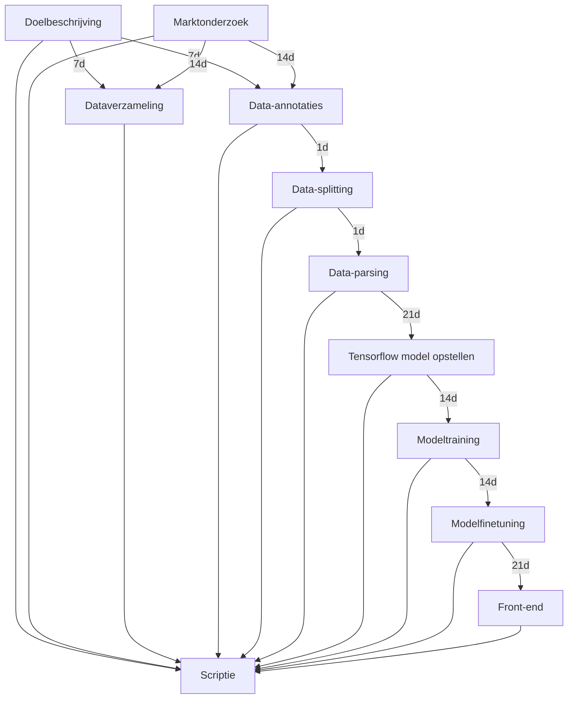
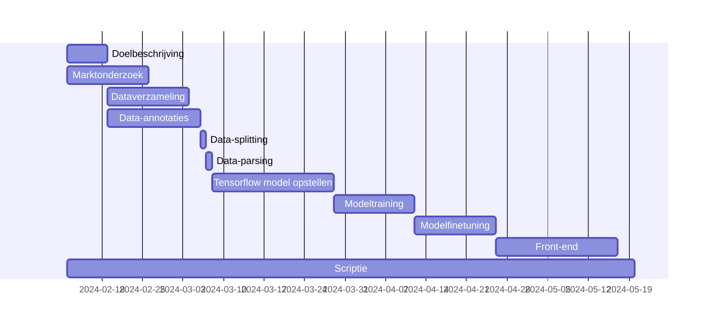

<!-- use mermaid -->
# Verloop

## Flowchart

```mermaid
flowchart
  A[Doelbeschrijving] --> |7d| C[Dataverzameling]
  A[Doelbeschrijving] --> |7d| D[Data-annotaties]
	A[Doelbeschrijving] --> K[Scriptie]
  B[Marktonderzoek] --> |14d| D[Data-annotaties]
	B[Marktonderzoek] --> |14d| C[Dataverzameling]
	B[Marktonderzoek] --> K[Scriptie]
	C[Dataverzameling] --> K[Scriptie]
  D[Data-annotaties] --> |1d| E[Data-splitting]
	D[Data-annotaties] --> K[Scriptie]
  E[Data-splitting] --> |1d| F[Data-parsing]
	E[Data-splitting] --> K[Scriptie]
  F[Data-parsing] --> |21d| G[Tensorflow model opstellen]
	F[Data-parsing] --> K[Scriptie]
  G[Tensorflow model opstellen] --> |14d| H[Modeltraining]
	G[Tensorflow model opstellen] --> K[Scriptie]
  H[Modeltraining] --> |14d| I[Modelfinetuning]
	H[Modeltraining] --> K[Scriptie]
  I[Modelfinetuning] --> |21d| J[Front-end]
	I[Modelfinetuning] --> K[Scriptie]
  J[Front-end] --> K[Scriptie]
```

## Gantt-chart

```mermaid
gantt
  Doelbeschrijving              : task1, 2024-02-12, 7d
  Marktonderzoek                : task2, 2024-02-12, 14d
  Dataverzameling               : task3, after task1, 14d
  Data-annotaties               : task4, after task1, 16d
  Data-splitting                : task5, after task4, 1d
  Data-parsing                  : task6, after task5, 1d
  Tensorflow model opstellen    : task7, after task6, 21d
  Modeltraining                 : task8, after task7, 14d
  Modelfinetuning               : task9, after task8, 14d
  Front-end                     : task10, after task9, 21d
  Scriptie                      : task11, 2024-02-12, 14w
```
